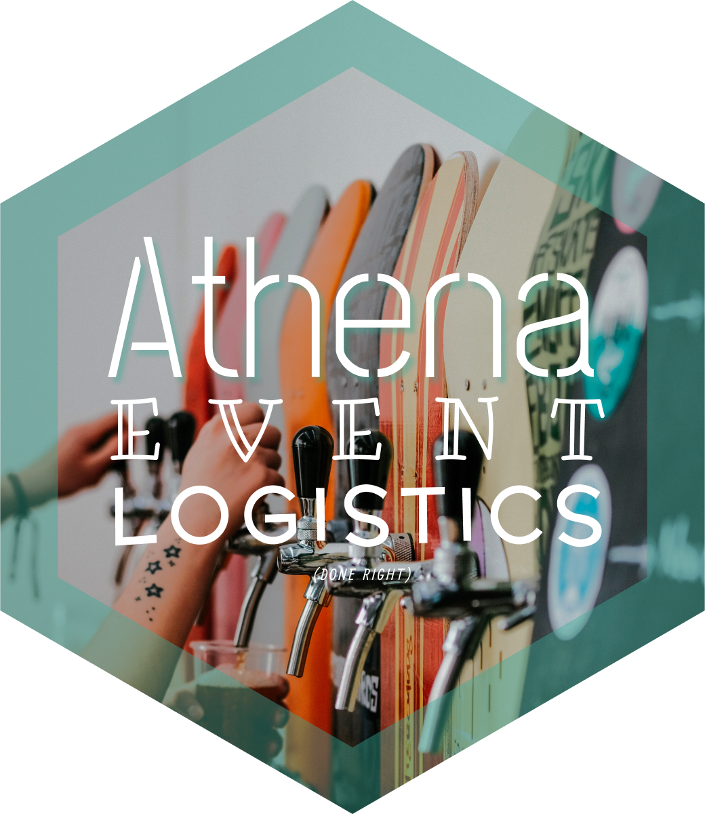

# Athena React Native App

:beer::tropical_drink::wine_glass: Event Logistics Management

## Development

* Run a backend - See https://github.com/athena-logistics/athena-backend
* Install Node using [`asdf`](https://asdf-vm.com/) as specified in `.tool-versions`
* `yarn install`
* `yarn start`